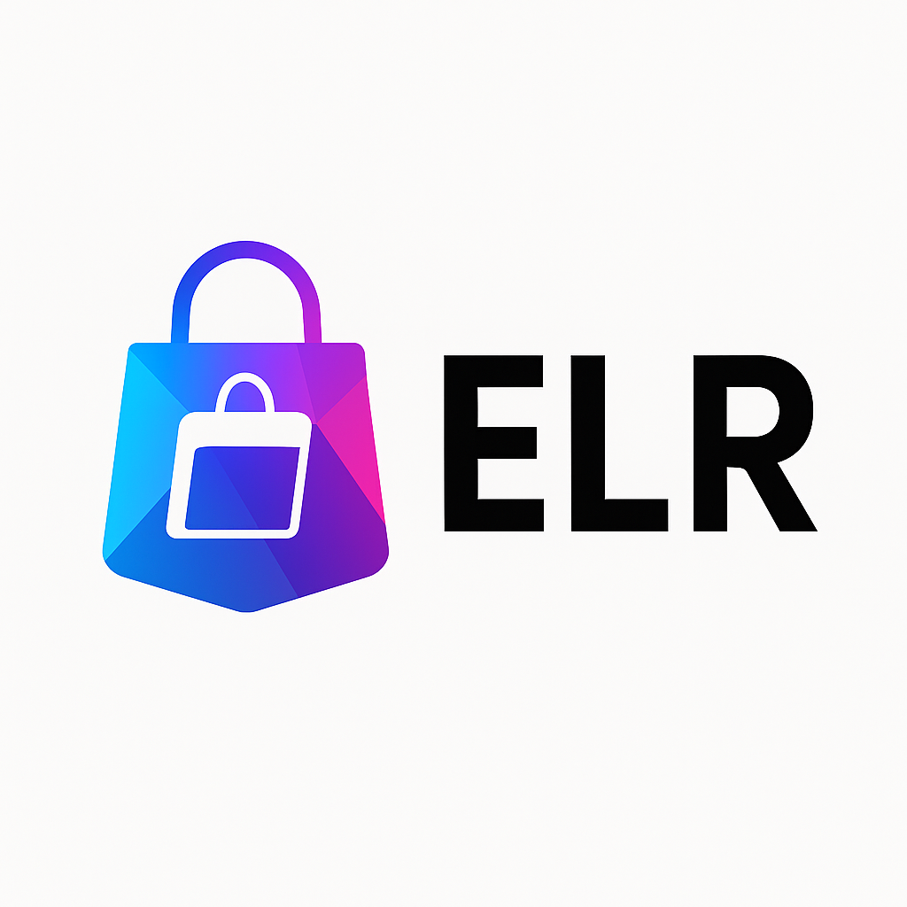
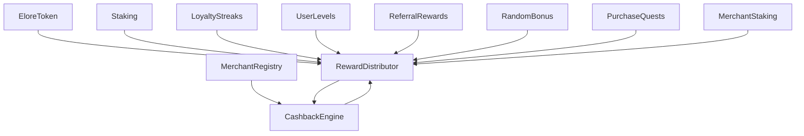

  

# 🚀 ELR Protocol – Mainnet Deployment Repository

ELR Protocol is a modular, production-grade rewards infrastructure designed for real-world commerce, loyalty systems, and token-powered incentives.

This repository contains:
- ✔️ Full smart contract suite  
- ✔️ Deployment & verification scripts  
- ✔️ Security test suites (attacks, fuzzing, integration)  
- ✔️ Verified contract addresses  
- ✔️ System architecture diagrams  

---

## 🔥 Key Features

- **Modular Architecture:** All features live in isolated modules connected via the RewardDistributor.  
- **CEX-Friendly Design:** No hidden mint, no blacklist, no tax logic.  
- **Enterprise-Ready:** Works for real commerce, loyalty programs & onboarding systems.  
- **Gamified Rewards:** Cashback, levels, streaks, referrals, quests, staking, and more.

---

## 🧱 Contract Modules Overview

### 1. **EloreToken (ELR)**
Core ERC-20 token used for rewards, staking, and merchant systems.

### 2. **MerchantRegistry**
KYB-enforced merchant onboarding system.

### 3. **RewardDistributor**
Central secure pool that all reward modules plug into.

Includes:
- Nonce-protected signature rewards  
- Module whitelisting  
- Reentrancy protection  

### 4. **CashbackEngine**
Merchant tier–based real-time cashback engine.

### 5. **Additional Modules**

| Module | Description |
|--------|-------------|
| **Staking** | Users lock ELR to boost rewards |
| **LoyaltyStreaks** | Daily/weekly spending streak multipliers |
| **UserLevels** | Long-term user level progression |
| **ReferralRewards** | Multi-tier referral payouts |
| **RandomBonus** | Surprise bonuses |
| **PurchaseQuests** | Merchant-created missions |
| **MerchantStaking** | Merchants stake ELR to boost reward tiers |

> **Note:**  
> *Timelock and ProxyAdmin removed — the protocol operates without upgrade governance.*

---

# 🧩 Ecosystem Diagram (Updated — No Timelock)

---

# 📜 Contract Addresses

## **Polygon Testnet — Amoy (ChainId 80002)**  
_Last updated: 5 Dec 2025_

| Contract | Address | Status | Verification |
|----------|---------|---------|--------------|
| **EloreToken** | `0x8E9abdF8759B0d2863A030E49406C05b30ed43Ed` | ✅ Deployed | ✅ Verified |
| **MerchantRegistry** | `0xC61C8C198E82E60f3DE422812ea8395b6B808e1B` | ✅ Deployed | ✅ Verified |
| **RewardDistributor** | `0x8Cd94160d912b4E646c49Fe7f3fEE6c9226Ec7c2` | ✅ Deployed | ✅ Verified |
| **CashbackEngine** | 0xE7d6820Af1f01bcB4608Af906f0f387f78E7E441 |  deployed | verified |
| **Staking** | _pending_ | ❌ | ❌ |
| **LoyaltyStreaks** | _pending_ | ❌ | ❌ |
| **UserLevels** | _pending_ | ❌ | ❌ |
| **ReferralRewards** | _pending_ | ❌ | ❌ |
| **RandomBonus** | _pending_ | ❌ | ❌ |
| **PurchaseQuests** | _pending_ | ❌ | ❌ |
| **MerchantStaking** | _pending_ | ❌ | ❌ |

---

## **Polygon Mainnet (Coming Soon)**  
Will be updated immediately after deployment.

| Contract | Address | Status |
|---------|---------|---------|
| **EloreToken** | ⏳ | Pending mainnet launch |
| **MerchantRegistry** | ⏳ | Pending |
| **RewardDistributor** | ⏳ | Pending |
| **CashbackEngine** | ⏳ | Pending |

---

# ⚙️ How the System Works

### **1. Purchases → Rewards**
1. Merchant is KYB-approved → added to MerchantRegistry  
2. User purchases → CashbackEngine calculates %  
3. RewardDistributor allocates ELR  
4. User claims reward  

---

### **2. Engagement Layer**
Modules like Streaks, Levels, Quests, and Referrals plug directly into RewardDistributor.

---

### **3. Security Hardening**
- Nonce-protected signed rewards  
- Reentrancy protection  
- Module-only access  
- Attack simulations included  
- Fuzzing & full-flow integration tests  

---

# 🧪 Test Suite Overview

| Test Type | Description |
|-----------|-------------|
| **Unit Tests** | Contract logic tests |
| **E2E Tests** | Full ecosystem simulation |
| **Attack Tests** | Reentrancy, impersonation, signature replay |
| **Fuzzing** | Randomized stress tests |

---

# 🛠 Deployment Scripts (Located in /scripts)

- `deploy-elr.js`  
- `deploy-registry.js`  
- `deploy-distributor.js`  
- `deploy-cashback.js`  
- `setup-all-vesting.js`  
- And more…

Each script automatically:
- Outputs TX hashes  
- Generates verification logs  
- Shows gas usage  
- Triggers Sourcify verification  

---

# 👥 Contributors

| Name | Role |
|------|------|
| **Brian Njau Njata** | Founder, Lead Developer, Architect |
| **ChatGPT (AI Assistant)** | Engineering support, debugging, system design |

---

# 📄 License

This project is licensed under **MIT License**.

---

# ⭐ Support the Project

If you find this useful, please ⭐ **star the repository** — it helps future development.

